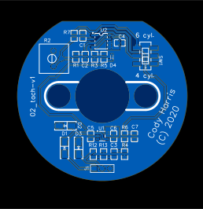
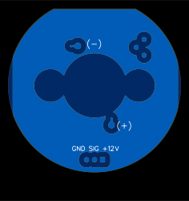

# BMW 2002 Tachometer Driver PCB

This project is a circuit board that modifies the stock BMW 2002 (aka E10) tachometer to use a pulsed 12V input as emitted from various ECUs. The circuit board replaces the circuit board inside the stock VDO tachometer for a clean installation. This project was developed for square tail light cars, I'm not sure if it works with the roundie tach.

The stock tachometer is driven by large voltage pulses from the primary windings of the car's single igniton coil. Aftermarket electronic ignition and EFI conversions typically output a 12V square wave/pulse RPM signal that doesn't reliably drive the stock tachometer.





# Design
The stock tachometer driver board uses a chip that has no datasheet available, SN29707, and was probably custom made for VDO. So rather than reverse engineer this custom chip, I just designed a new board around the ubiquitous LM2907 frequency to voltage converter. It's likely that the original tachometer driver IC is pretty similar anyway, looking at the part numbers.

I started my design by removing the stock driver board and using a bench DC power supply to drive the clockwork-like mechanism inside the tachometer directly. My measurements are listed in the following table showing indicated engine speeds (`RPM`) and the DC input voltage (`v_in`) necessary to make the needle move to each `RPM`. My power supply could not accurately measure the low currents involved.

```
f (Hz)	RPM 	v_in
33.33	1000	0.25
66.67	2000	0.46
100.01	3000	0.64
133.35	4000	0.83
166.69	5000	1.01
200.03	6000	1.25
233.37	7000	1.47
266.71	8000	1.73

```

The best-fit line through the above data relating f to v_in has a slope of 6.34e-3 V/Hz.

The LM2907 application note explains how to choose good values for the external components that set the frequency to voltage conversion factor, so I won't summarize here. I also chose to use a 10V LDO somewhat arbitrarily but also with an eye to the operating margins of the LM2907.

Following the LM2907 app note's guidance, I settled on a 22nF C_1, which has an ideal r_1 of around 29k. I chose to use a 20k r_1 in series with a 20k trimpot for wide adjustability. The reality is that I only have my tachometer as a reference and I don't know how representative it may be, so I might as well make it really adjustable.

Later, I threw in a 6 cyl/4 cyl selector switch to put a suitable resistance in parallel with r_1 for cars with more cylinders than stock. In hindsight, it's probably unnecessary and could have been replaced by replacing r_1 entirely with a trimpot of the appropriate value.

Finally, based on practical testing an earlier revision of the design, I added input bandpass filtering and attenuation to reduce the impact of electrical noise on the final output.

The board is 2-layer with a top layer ground pour and a bottom layer vcc pour. Nearly all of the routing is on the top layer.

I used an in-browser tool called EasyEDA to capture schematics, simulate the input filtering, and lay out the PCB. It's extremely limited, but was needs suiting for this simple board. Unfortunately, it has bugs that resulted in garbage wayyyy off the board in the gerbers, but OSH Park support manually cleaned them up for me. I tried out several different PCB fabs: OSH Park, JLCPCB, and Aisler. OSH Park made the best PCBs, closely followed by Aisler. JLCPCBs were much cheaper (made in PRC), but the top silk screen layer was missing many labels and the boards took a long time to arrive.

Here is a link to the public project on EasyEDA: https://easyeda.com/ahR9co1o/okok
